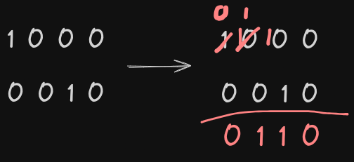
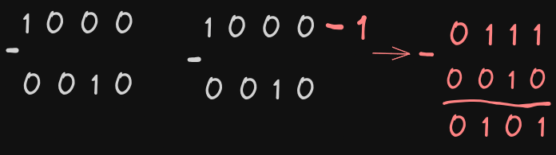

# Two's complement trick revealed


In my last post, I broguth light to IEEE 754 standard and I got some sections to give you an overview how computers do
math.

We established that the IEEE 754 standard is not that useful for integer numbers and we used two's complement instead.
In that post I promised to get back for a deeper explanation of Two~s complement.


# Recap two's complement

## The Definition

> Two’s complement is a mathematical operation to reversibly convert a positive binary number into a negative binary number with an equivalent negative value, using the binary digit with the greatest place value as the sign to indicate whether the binary number is positive or negative. It is used in computer science as the most common method of representing signed (positive, negative, and zero) integers on computers,[1] and more generally, fixed point binary values. When the most significant bit is 1, the number is signed as negative; and when the most significant bit is 0 the number is signed as positive.
>
> Source: wikipedia

## Our 3-bit machine

| Binary  | Decimal  |
| ------------ | ------------ |
| 000  |  0 |
| 001  | 1  |
| 010 | 2  |
| 011  |  3 |
| 100  |  -4 |
| 101  | -3  |
| 110  |  -2  |
| 111  |  -1 |

## Playing a bit

In two's complement we can convert a positive binary number into a negative binary number and vice versa using the same
procedure that is describe as following:

1. invert all bits;
2. add 1 to the result from last step.

### Conversions

#### Converting 3 to -3

We get 3 (10) that is `011` and then:

1. invert all bits resulting into `100`
2. add `1` to `100` resulting into `101`.

Our final result is `101` which is, indeed, -3 (10)

#### Converting -2 to 2

We get 2 (10) that is `010` then:

1. invert all bits resulting into `101`;
2. add `1` to the result from step 1, so `101 + 1` resulting into `110`.

After applying the procedure we ended up with `110` that is `-2 (10)`.

# Trick Revealed

It's all modular arihmetic it's been that all this time.

## Modular Arithmetic 101

Modular arithmetic is a system of arithmetic for integers where numbers reset when reaching a certain value - known as modulus.

A familiar application of this arithmetic is the 12-hour clock. Every twelve hours the time gets reset. If it's 11:00,
then 2 hours later it will be 1:00. Indeed, 11 + 2 is equal to 13 which in modulus 12 it becomes 1 - because we reset whenever it reaches to the _modulus_, 12 in this case. We say that 13 and 1 are congruents modulus 12.

#### In math notation:

1 &TildeFullEqual; 13 (mod 12)

Twelve, in this case, is the modulus. Whenever the number reaches tweleve, it gets reset. That's why `13 (mod 12) = 1`.
If you think more you figure out that `26 (mod 12)` is also congruent to `1`.

Think about it:

```
13 = (12 + 1) // one cycle completed plus 1
25 = (24 + 1) // two cycles completed plus 1
```

Every completed cycle turns the clock to zero, so adding 1 to the result is equal to 1. I hope it didn't confuse that
much. We will see more details in the next section.

### Congruence

_a_ and _b_ are said to be congruent _modulo n_ if there's an integer _k_ such that:

a - b = kn, n > 1

It's to see that this relation can also be written as:

```
a = kn + b.
```

It looks familiar to what we saw in the last section. We defined 25 congruent to 1 in modulus 12. If we write using the
relation showed before we have

```
25 = 12k + 1.
```

That's exactly what we did with the 24 + 1. 24 is just 12 &times; 2. So, 24 + 1 = 12&times;2 + 1 - our _k_ is 2.

## How it applies to Two's complement

The whole thing is about _cycles_. We get an infinite set of numbers and we make it to fit into a smaller set.
Any integer number modulus 12 will never be less than zero neither greater than eleven. Numbers in modulus `n` have the
range: zero to `n-1`.

It's important to observe how the things get complimented. In modulus 12, to get from 1 to 11 we can either:

- subtract 2;
- or add 10.

To get from 1 to 10 we can either add 9 ou subtract 3. If you put it into a table you'll eventually reach to the
following relation:

```
Subtract "a" from a number "b" modulus n is equivalent to add n - a.

Hence, b - a (mod n) <=> b + (n - a) (mod n)
```

Illustrating, subtract 2 from 1 (mod 12) is the same as adding 10 (aka 12 - 2). Subtracting 3 is the same as adding
9 (aka 12 - 3).

### Applying the concepts

In our 3-bit machine, thinking about about unsigned numbers we can represent from 0 to 7. We can't represent less
or more, if we get an overflow like 1000<sub>2</sub> it actually gets "reset" to 000<sub>2</sub>. Well, it's easy now that we know the behaviour of a number in modular arithmetic.

Our machine is, indeed, modulus 8. So, subtracting a number `a` from any number `b` in our machine is the same as adding
`8 - a`.

To subtract 2 from any any number we just need to sum (8-2). Remember, we are operating in modulus eight. In binary,
it's basically adding 1000 - 010.

As an example, let's say we want subtract 2 from 3. We would do: 011 + (1000 - 010). Performinf the operation 1000 - 010
will result into 110, that's -2 in twos complement. So the operation becomes 011 + 110 hence the result of the whole
operation is 001.

#### A closer look

Why does 1000 - 010 work turning 2 into -2?

Well, to perform this subtraction we would need to do something like:



It is very similar to what we do in decimal. We keep borrowing from next column. Even though it is similar, it might be
a little confusing looking this way since we're not accostumed with binary system.

To simplify things we can do some mathematical trick. Instead of just get straight and do the subtraction as we did in
the last step we will sum zero to this expression, but in a clever way. We will subtract 1 from the minuend then add
1 to the difference.

Then, instead of 1000 - 010 we will have (1000 - 1) - 010 that is equivalent to 111 - 010 [eq 1]. This subtraction is
much simpler to do. Indeed, it just flips out the subtrahend bits: 111 - 010 = 101 [3].



Now we can balance our expression by adding 1 to the difference: 101 + 1 which is equal to 110.

### We did it (haven't you seen?)!

We just did Two's complement. Since we need to add 1000 - 010, it is the same as (1000 - 1) - 010 + 1. Simplifying we
have: 111 - 010 + 1.

The 111 - 010 flips out the bits. In fact, every subtraction where the minuend has all the bits set to 1 will flips out
the minuend bits.

```
a - b = !b

a, has all bits set to 1
```

After this operation we just add one to the `difference` that is the second step in the Two's complement algorithm.

#### Performing an operation from scratch

Let's perform the operation 3 - 2.

011 - 010
=> 011 + (1000 - 1 - 010 + 1)
=> 011 + (111 - 010 + 1)
=> 011 + (101 + 1)
=> 011 + 110 = 1001

you know, we throw the MSB (carry out) away our final result is 001 (exactly 1<sub>10</sub>).

# Summary
